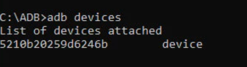

# Mobile App Automation with Appium


## Description 
A training automation project to test native apps. As an example, the Wikipedia app has been selected to use in this automation project. The .apk file is stored within `/src/test/resources` path 

## Starting 🚀

### Environment setting

  - Java JDK installed 1.8 [download](https://www.oracle.com/co/java/technologies/javase/javase8-archive-downloads.html)
  - Maven installed [download]()
  - Appium Server installed [download](https://github.com/appium/appium-desktop/releases)
  - Any physical o emulated device to test.


### Installation 🛠️
Once you have cloned the repository on your computer, open a terminal and run the following command:
```
mvn clean install
```


#### Config devices🔧
- Physical devices: On your device, activate developer mode, and enable "USB Debugging".
- Emulated device: 
  - Android
    Prerequisites: Android SDK installed.
    > It is necessary to ensure that is enabled the 'Hypervisor' on your local enviroment, [how to configure it](https://learn.microsoft.com/en-us/virtualization/hyper-v-on-windows/quick-start/enable-hyper-v))
    
    It is recommended to restart the computer before running an emulator in order for the changes to take effect.
  - Create a Virtual Device (AVD) in Android Studio, more info [link](https://developer.android.com/studio/run/managing-avds?hl=es-419#createavd)
  - Use `adb` command to install the .apk file on your emulated device 
  
    > `install [option] <PATH>`
    
    Also, the .apk file can be dragged to the emulated device.


#### Getting Capabilities🔩

Appium capabilities must be configured in one of the android.properties or ios.properties files depending on the selected device type. Must be include device-related information such as platformName, platformVersion, deviceName, and appPackage/appActivity for Android devices

in physical devices, once the mobile device is connected to the computer, it is possible to confirm that the device is properly configured and ready to be managed by Appium using the adb command 

```powerShell
adb devices
```
returning a list of connected devices with their deviceId associated



Some main capabilities can be known:

`PlatformVersion`: adb -s "deviceId" shell getprop ro.build.version.release

`DeviceName`: adb -s "deviceId" shell getprop ro.product.model


### Running tests 🧪

Open a terminal and run the following command:

```
mvn clean verify
```

## Links 🔗
Have comments? Let me know on Twitter: [@Luisaferco](https://twitter.com/LuisaFer0826)

My Linkedin profile on [Luisa Colorado](https://www.linkedin.com/in/luisa-fernanda-ce-81a399137)